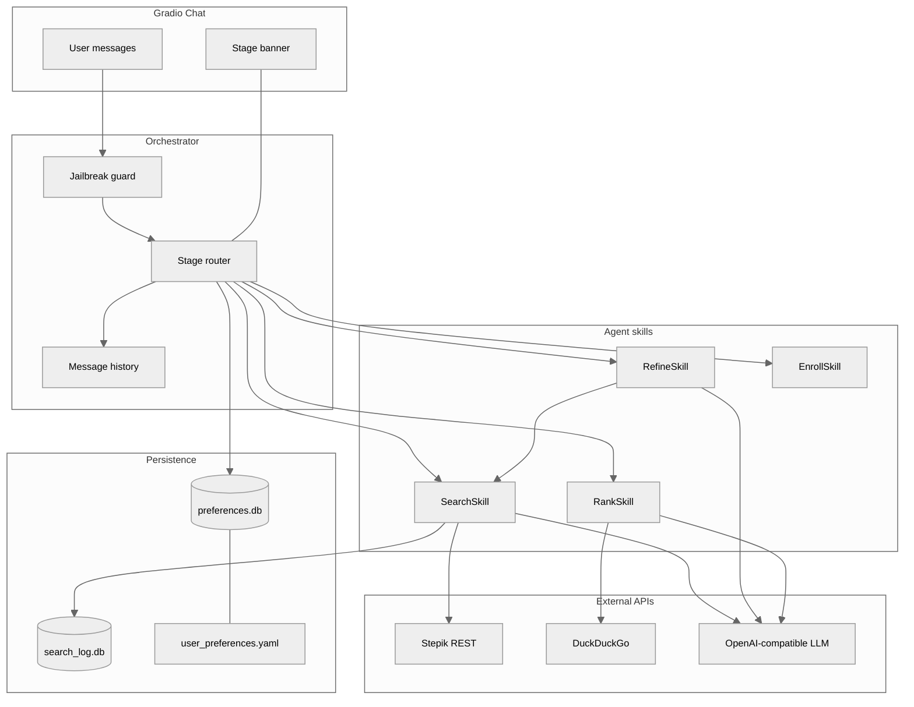
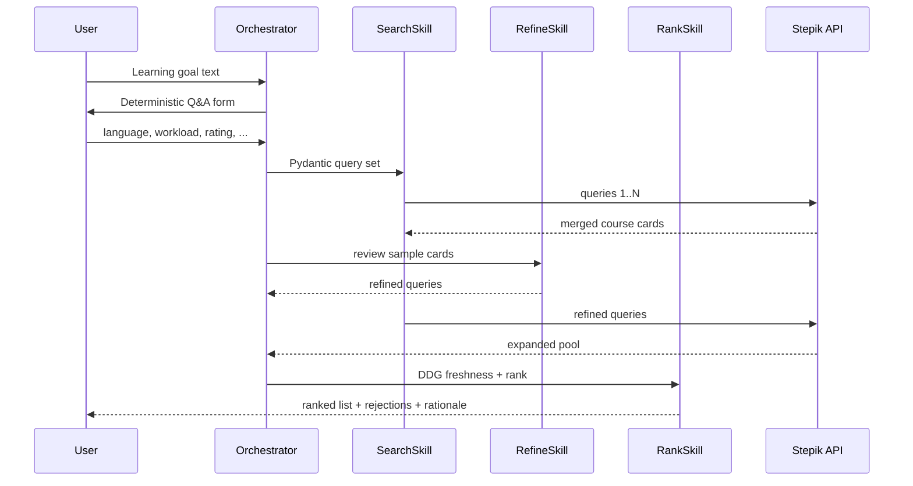

# Stepik Agent

## Overview

Multi-agent assistant for personalised Stepik course discovery. The user states a learning goal in free text, then fills categorical and numeric constraints through explicit Q&A. Search queries are produced only via Pydantic `BaseModel` schemas. The pipeline merges several Stepik API result sets, applies deterministic filters, iteratively refines queries, checks topic freshness for 2026 through DuckDuckGo, and ranks courses with field-level evidence. Gradio provides a chat UI with visible agent stages. Preferences and search events persist in SQLite across sessions.

Repository: [pymlex/stepik-agent](https://github.com/pymlex/stepik-agent)

## Architecture



### Iterative search flow



## Design decisions

| Area | Decision |
| --- | --- |
| Free text vs filters | Goals come from chat only. Language, paid flag, workload, rating, learners_count are parsed from the form block. Missing fields stay `null`, never inferred. |
| Query generation | `StepikSearchQuerySet` and `StepikSearchQueryRefinement` in `models/schemas.py`. LLM output is validated before any API call. |
| Search merge | Up to five queries per round. Results deduplicated by `course_id`. Each query and id list stored in `search_log.db`. |
| Deterministic filter | `stepik_agent/stepik/filters.py` rejects courses before LLM ranking. Reasons are exposed in chat. |
| Agent skills | Four skills only: search, refine, rank, enroll. Orchestrator owns stage transitions. |
| Freshness | `RankSkill` builds DDG queries from course snippets, then feeds snippets into ranking context. |
| Jailbreak | Regex guard in `stepik_agent/security/jailbreak.py` blocks instruction override patterns. |
| Logging | `logging` to `logs/agent.log`. `scripts/search_logs.py` queries log lines and SQLite. |
| MCP | `mcp_server/server.py` exposes `stepik_search`, `get_preferences`, `list_search_log`. |
| Enrollment | `EnrollSkill` requires «подтверждаю запись». Playwright script closes browser safely on window exit. |
| Tests | Ten `pytest` cases with `JudgeVerdict` LLM-as-a-Judge. Mock LLM when `STEPIK_AGENT_MOCK_LLM=1`. |

## Repository layout

```
stepik-agent/
├── config/
│   └── user_preferences.yaml
├── models/
│   └── schemas.py
├── stepik_agent/
│   ├── agents/
│   │   ├── orchestrator.py
│   │   └── skills/
│   ├── db/
│   ├── gradio_app/
│   ├── llm/
│   ├── pipeline/
│   ├── search/
│   ├── security/
│   └── stepik/
├── mcp_server/
│   └── server.py
├── scripts/
│   ├── run_demo.py
│   ├── enroll_course.py
│   ├── search_logs.py
│   └── run_*.ps1
├── tests/
│   └── test_agent_judge.py
├── examples/
│   └── prompts.yaml
└── main.py
```

## Setup

```bash
git clone https://github.com/pymlex/stepik-agent
cd stepik-agent
pip install -r requirements.txt
playwright install chromium
cp .env.example .env
cp stepik_config.json.example stepik_config.json
```

Fill `.env` with `OPENAI_API_KEY` or `ZVENOAI_API_KEY` for [Zveno API](https://api.zveno.ai/v1), optional `HF_TOKEN`, `GITHUB_TOKEN`, `STEPIK_API_TOKEN`. Set `STEPIK_AGENT_MOCK_LLM=1` for offline runs without LLM.

```powershell
git clone https://github.com/pymlex/stepik-agent
cd stepik-agent
pip install -r requirements.txt
$env:PYTHONPATH = (Get-Location)
```

## Quick run

From the repository root after `cd stepik-agent`:

| Task | Windows | Linux / macOS |
| --- | --- | --- |
| Full report run | `run_report.bat` | `python scripts/generate_report.py` |
| E2E check | `run_e2e.bat` | `python scripts/run_e2e.py` |
| Gradio chat | `run_gradio.bat` | `python main.py` |

`bootstrap_path.py` adds the project root to `sys.path` automatically. No `PYTHONPATH` required.

## Run commands

### Gradio chat

```powershell
.\run_gradio.bat
```

```bash
python main.py
```

### Report and E2E

```powershell
.\run_report.bat
.\run_e2e.bat
```

```bash
python scripts/generate_report.py
python scripts/run_e2e.py
```

Report output: `artifacts/report_run.txt`. Expected E2E line: `E2E PASS`.

### Demo without Gradio

```bash
python scripts/run_demo.py
```

### Tests with LLM-as-a-Judge

```powershell
.\scripts\run_tests.ps1
```

### Search log audit

```powershell
python scripts/search_logs.py --mode queries
python scripts/search_logs.py --mode log --pattern "search query="
python scripts/search_logs.py --mode all --session abc12345
```

### MCP server

```powershell
.\scripts\run_mcp.ps1
```

### Course enrollment

Fill `stepik_config.json`, then:

```powershell
python scripts/enroll_course.py "https://stepik.org/course/67/promo"
```

In chat: `запись на курс 67`, then `подтверждаю запись`.

### Legacy reference

`legacy.py`, `ddg_search_legacy.py`, and `stepik_legacy.py` remain as reference implementations. Runtime code lives under `stepik_agent/`.

## Gradio conversation flow

1. Assistant greeting about Stepik course discovery.
2. User sends a learning goal in natural language.
3. Assistant posts deterministic Q&A for language, paid courses, learners_count, workload, rating.
4. User answers line by line, or writes «пропустить».
5. Assistant shows stage banners: query generation, initial search, review, refine, second search, freshness, rank.
6. Assistant prints ranked courses with `field: excerpt` evidence, ranking rationale, and filter rejections.
7. Follow-up: «ещё поиск», priority hints, questions about a course, enrollment with confirmation.

## User preferences

Default values in `config/user_preferences.yaml`:

| Key | Default |
| --- | --- |
| `default_result_count` | 5 |
| `message_tone` | supportive |
| `preferred_language` | ru |

Runtime updates are stored in `data/preferences.db` and merged into prompts.

## Citation

```bibtex
@software{zyukov2026stepikagent,
  author  = {Zyukov, Alex},
  title   = {Stepik Agent: Multi-agent course discovery on Stepik},
  year    = {2026},
  url     = {https://github.com/pymlex/stepik-agent},
  version = {0.1.0}
}
```

The project is under GPL-3.0 license.

## References

```bibtex
@misc{brown2020language,
  title         = {Language Models are Few-Shot Learners},
  author        = {Tom B. Brown and Benjamin Mann and Roy Weakfield and others},
  year          = {2020},
  eprint        = {2005.14165},
  archivePrefix = {arXiv},
  primaryClass  = {cs.CL},
  url           = {https://arxiv.org/abs/2005.14165}
}
```
