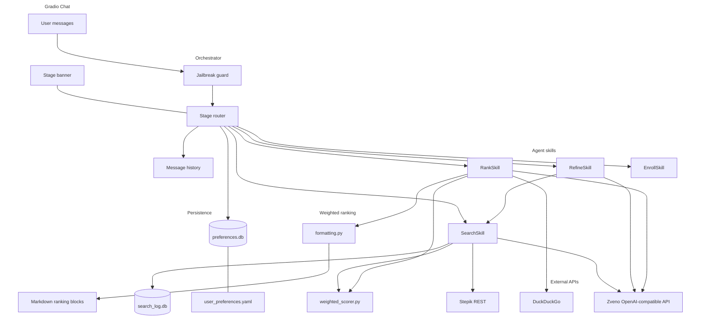
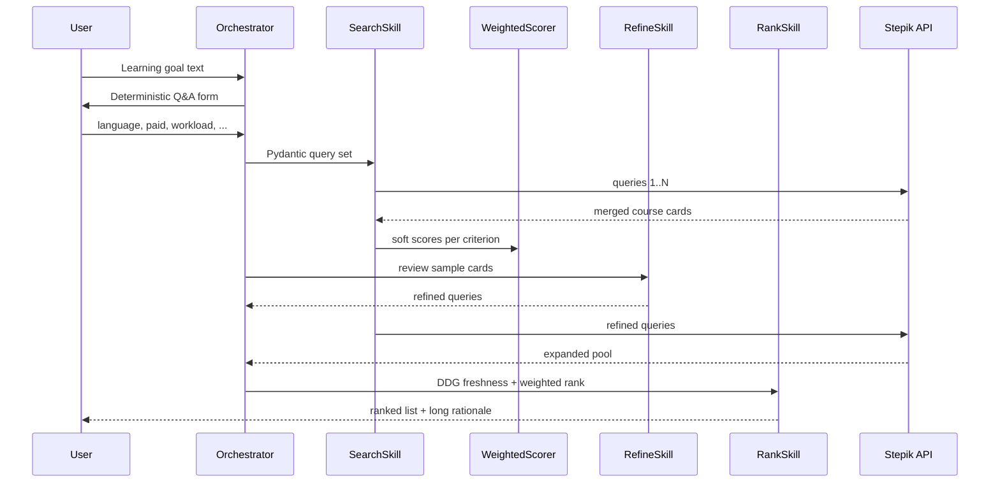

# Stepik Agent

## Overview

Multi-agent assistant for personalised Stepik course discovery. The user states a learning goal in free text, then fills categorical and numeric constraints through explicit Q&A. Search queries are produced only via Pydantic `BaseModel` schemas. The pipeline merges several Stepik API result sets, iteratively refines queries, checks topic freshness for 2026 through DuckDuckGo, and ranks courses with weighted criteria and field-level evidence. Gradio provides a chat UI with visible agent stages and Markdown rendering. Preferences and search events persist in SQLite across sessions.

Repository: [pymlex/stepik-agent](https://github.com/pymlex/stepik-agent)

## Architecture



### Iterative search flow



## Weighted ranking

Courses are not hard-dropped when a preference mismatches. Each criterion yields a score $s_i \in [0,1]$. The total score is a weighted sum. Missing form fields map to a moderate default score $0.35$, not inference from free text.

| Criterion | Weight | Role |
| --- | ---: | --- |
| `relevance_to_goal` | 0.32 | overlap between goal and course card text |
| `freshness_2026` | 0.14 | DuckDuckGo snippets about topical relevance |
| `language_fit` | 0.12 | soft penalty if language differs from form |
| `price_fit` | 0.10 | soft penalty if paid or free preference mismatches |
| `workload_fit` | 0.10 | workload vs user cap |
| `rating_quality` | 0.08 | rating vs threshold or missing rating |
| `learners_fit` | 0.08 | learners_count vs minimum |
| `popularity` | 0.06 | learners_count scale |

Paid filter is applied locally after Stepik search. The API parameter `is_paid` is not used, because it often returns an empty list.

## Design decisions

| Area | Decision |
| --- | --- |
| Free text vs filters | Goals come from chat only. Language, paid flag, workload, rating, learners_count are parsed from a five-line form block. Missing fields stay unset, never inferred from the goal. |
| Query generation | `StepikSearchQuerySet` and `StepikSearchQueryRefinement` in `models/schemas.py`. LLM JSON is repaired and type-normalised before validation. |
| Search merge | Up to five queries per round. Results deduplicated by `course_id`. Each query and id list stored in `search_log.db`. |
| Soft constraints | `stepik_agent/ranking/weighted_scorer.py` lowers scores instead of rejecting courses. |
| Agent skills | Four skills: search, refine, rank, enroll. Orchestrator owns stage transitions. |
| Freshness | `RankSkill` runs DDG queries, then refreshes `freshness_2026` scores. |
| Chat output | `stepik_agent/gradio_app/formatting.py` builds Markdown tables and section breaks for Gradio 6. |
| LLM robustness | `json_parse.py` and `schema_normalize.py` handle broken JSON and wrong field types. |
| Jailbreak | Regex guard in `stepik_agent/security/jailbreak.py`. |
| Logging | `logs/agent.log` and `scripts/search_logs.py`. |
| MCP | `mcp_server/server.py` exposes `stepik_search`, `get_preferences`, `list_search_log`. |
| Enrollment | Chat phrase «подтверждаю запись» plus `scripts/enroll_course.py` with safe browser close. |
| Path bootstrap | `bootstrap_path.py` sets `sys.path` from any entry script. No `PYTHONPATH` required. |

## Repository layout

```
stepik-agent/
├── bootstrap_path.py
├── main.py
├── run_gradio.bat
├── run_e2e.bat
├── run_report.bat
├── config/
│   └── user_preferences.yaml
├── models/
│   └── schemas.py
├── stepik_agent/
│   ├── agents/
│   │   ├── orchestrator.py
│   │   └── skills/
│   ├── db/
│   ├── gradio_app/
│   │   ├── app.py
│   │   └── formatting.py
│   ├── llm/
│   │   ├── client.py
│   │   ├── json_parse.py
│   │   └── schema_normalize.py
│   ├── ranking/
│   │   └── weighted_scorer.py
│   ├── pipeline/
│   ├── search/
│   ├── security/
│   └── stepik/
├── mcp_server/
│   └── server.py
├── scripts/
│   ├── generate_report.py
│   ├── run_demo.py
│   ├── enroll_course.py
│   ├── search_logs.py
│   └── run_*.ps1
├── artifacts/
│   └── report_run.txt
├── examples/
│   └── prompts.yaml
├── DELIVERABLE_RU.md
└── tests/
    └── test_agent_judge.py
```

## Setup

```bash
git clone https://github.com/pymlex/stepik-agent
cd stepik-agent
pip install -r requirements.txt
playwright install chromium
cp .env.example .env
cp stepik_config.json.example stepik_config.json
```

Edit `.env`:

| Variable | Purpose |
| --- | --- |
| `OPENAI_API_KEY` or `ZVENOAI_API_KEY` | LLM access, default base URL `https://api.zveno.ai/v1` |
| `OPENAI_MODEL` | default `openai/gpt-oss-120b` |
| `STEPIK_API_TOKEN` | optional Stepik API token |
| `STEPIK_AGENT_MOCK_LLM` | set `1` for offline demo without LLM |
| `STEPIK_AGENT_LOG_DIR` | default `logs` |
| `STEPIK_AGENT_DATA_DIR` | default `data` |

## Quick run

Run commands from the repository root after `cd stepik-agent`.

| Task | Windows | Linux / macOS |
| --- | --- | --- |
| Gradio chat | `run_gradio.bat` | `python main.py` |
| Full report | `run_report.bat` | `python scripts/generate_report.py` |
| E2E check | `run_e2e.bat` | `python scripts/run_e2e.py` |
| Demo without UI | `python scripts/run_demo.py` | same |

## Gradio conversation flow

1. Assistant greeting about Stepik course discovery.
2. User sends a learning goal in natural language.
3. Assistant asks for five lines: language, paid preference, min learners, max workload hours, min rating. Use «пропустить» to skip a field.
4. Pipeline stages appear as `### Этап: ...` banners.
5. Response contains weighted ranking: per-course criteria table, short summary, long rationale section.
6. Follow-up phrases: «ещё поиск», priority hints, «можно платные» to drop free-only filter, «запись на курс 67», then «подтверждаю запись».

### Example form block

```
ru
пропустить
3
пропустить
пропустить
```

Line 2: `да` means free courses only, `нет` or `пропустить` allows paid courses.

## Other commands

### Search log audit

```bash
python scripts/search_logs.py --mode queries
python scripts/search_logs.py --mode log --pattern "search query="
python scripts/search_logs.py --mode all --session SESSION_ID
```

### MCP server

```bash
python mcp_server/server.py
```

### Course enrollment

```bash
python scripts/enroll_course.py "https://stepik.org/course/67/promo"
```

### Tests with LLM-as-a-Judge

```bash
set STEPIK_AGENT_MOCK_LLM=1
python -m pytest tests/ -v
```

### Legacy reference

`legacy.py`, `ddg_search_legacy.py`, and `stepik_legacy.py` are reference snippets. Runtime code lives under `stepik_agent/`.

## User preferences

Defaults in `config/user_preferences.yaml`:

| Key | Default |
| --- | --- |
| `default_result_count` | 5 |
| `message_tone` | supportive |
| `preferred_language` | ru |

Runtime updates are stored in `data/preferences.db` and merged into prompts.

## Submission notes

Russian deliverable text for assignments: [DELIVERABLE_RU.md](DELIVERABLE_RU.md). Latest automated run log: `artifacts/report_run.txt`.

## Citation

```bibtex
@software{zyukov2026stepikagent,
  author  = {Zyukov, Alex},
  title   = {Stepik Agent: Multi-agent course discovery on Stepik},
  year    = {2026},
  url     = {https://github.com/pymlex/stepik-agent},
  version = {0.2.0}
}
```

The project is under GPL-3.0 license.

## References

```bibtex
@misc{brown2020language,
  title         = {Language Models are Few-Shot Learners},
  author        = {Tom B. Brown and Benjamin Mann and Roy Weakfield and others},
  year          = {2020},
  eprint        = {2005.14165},
  archivePrefix = {arXiv},
  primaryClass  = {cs.CL},
  url           = {https://arxiv.org/abs/2005.14165}
}
```
